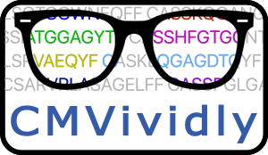

---
listing:
  contents: posts/*/index.qmd
  sort: "date desc"
  type: default
  categories: true
  sort-ui: false
  filter-ui: false
page-layout: full
number-sections: False
---

Welcome! I'm Damon May, a lead author of the ["ECOclusters" preprint](https://www.biorxiv.org/content/10.1101/2024.03.26.583354).
That work discovers the public T-cell responses to viruses, bacteria, etc., by finding groups
of T-cell receptors (TCRs) that tend to occur in the same people.

The Cytomegalovirus (CMV) ECOcluster is publicly available. Here, I'm doing public data exploration of the CMV ECOcluster to help [the AIRR community](https://www.antibodysociety.org/the-airr-community/)
and others make the best use of this new public resource ([more detail](about.qmd)). I'll post updates here and publicize them on my [LinkedIn](https://www.linkedin.com/in/damonhmay).
For more background, check out [About](about.html) and the [GitHub repo](https://github.com/dhmay/CMVividly).

So, those TCRs... let's see 'em, vividly.

## Posts